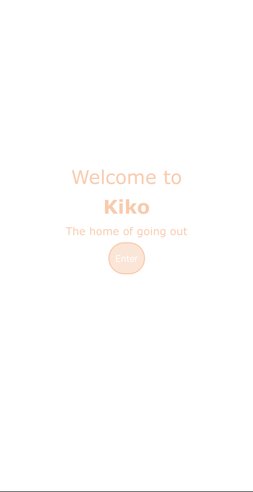
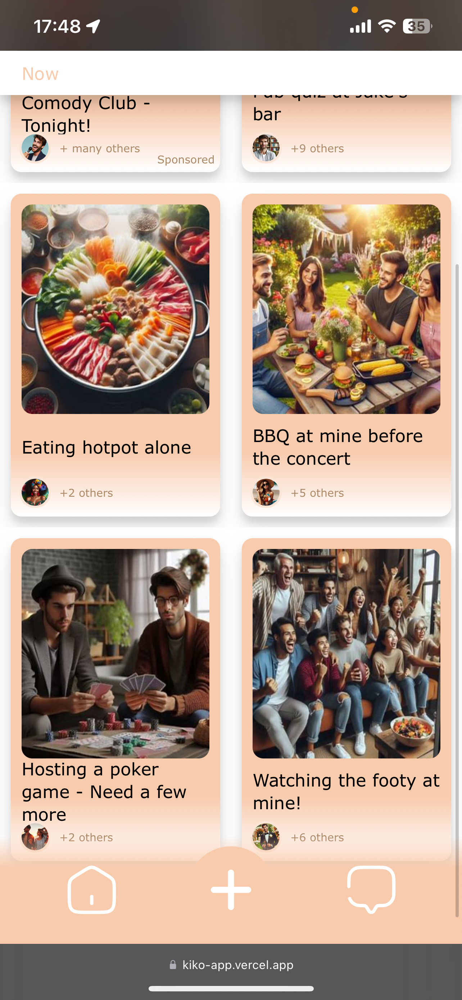
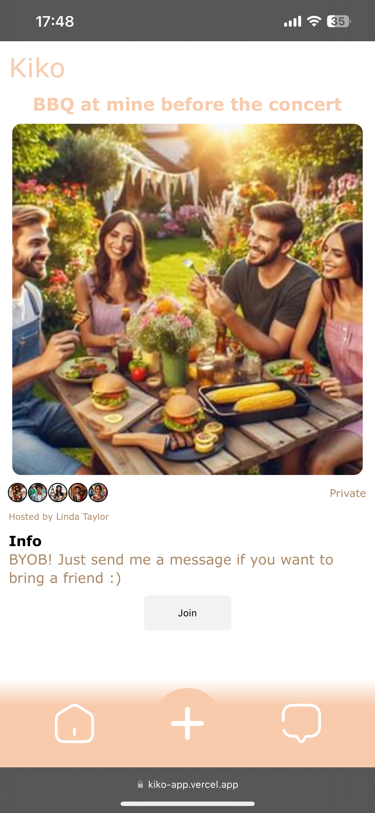
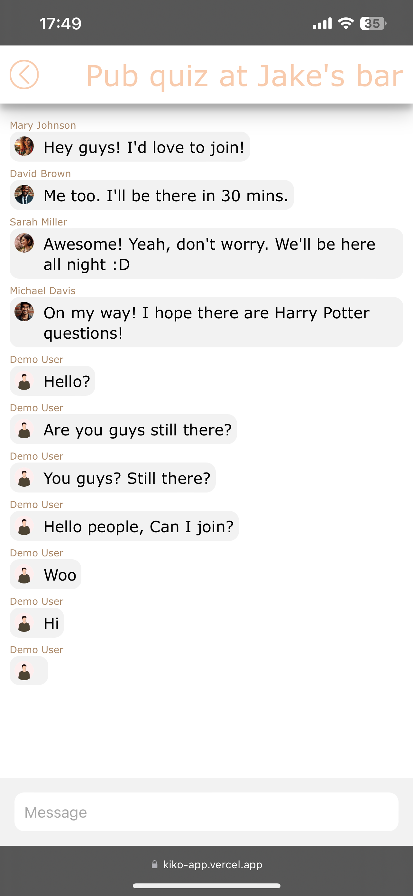
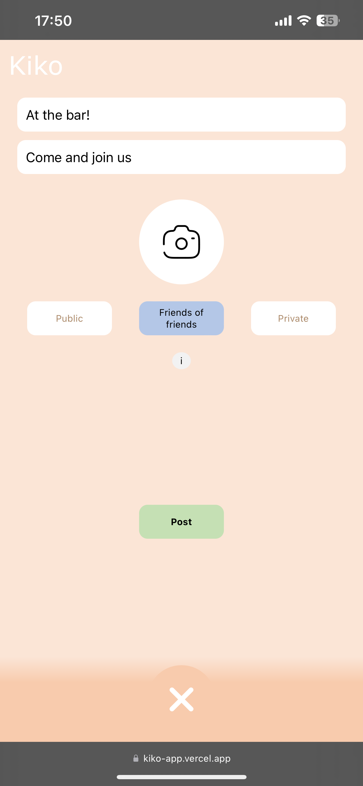

# Moment

---

## About this project

This is project was set by the Odin Project as the second of 3 final full stack projects designed to showcase everything that's been taught in the full course. 

The course set an assignment to copy and re-create any popular social media site.  However, I wanted to take this a step further and include design in my stack.  So I developed my own 'social media' site called Kiko. 

Kiko is a take from the Japanese word Hikikomori, Referencing the people that stay inside for sometimes years on the end. The app is an event based social act that allows users to post what they are doing and select who they would like to be able to see that particular event. 

No more need for endlessly messaging your friends waiting for everyone to make the first move. Go out, post it and let the 6 degrees of separation works it's magic to connect you with people around you IN REAL LIFE!

---

## Technologies

JS

CSS

React

NodeJS

MongoDB

OAuth

---
## Live Link

https://kiko-app.vercel.app

---

## Screenshots

### Picture 1

### Picture 2

### Picture 3

### Picture 4

### Picture 5

